   

<br>
<br>

# Unidad 8. Persistencia en la nube.

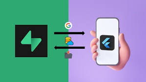

<br>

Como vimos en el tema anterior, la persistencia de los datos es una pieza fundamental en el desarrollo de aplicaciones, y en el mismo desarrollamos el almacenamiento local haciendo uso de la librería `Floor`.

La persistencia en la nube se refiere al almacenamiento y gestión de datos en servidores remotos accesibles a través de internet. Esta tecnología permite a las aplicaciones almacenar datos de manera segura y escalable, eliminando la necesidad de infraestructura física local. Los servicios de persistencia en la nube ofrecen ventajas como alta disponibilidad, recuperación ante desastres, y acceso global, lo que facilita la colaboración y el acceso a la información desde cualquier lugar.

En este tema vamos a trabajar con `Supabase`, que es una plataforma de código abierto que proporciona una solución completa para la persistencia en la nube, incluyendo bases de datos, autenticación y capacidades en tiempo real. 

[1. Introducción a Supabase con Flutter](#_apartado1)

[2. App Planetas](#_apartado2)

[3. App Students](#_apartado3)

<br>

# <a name="_apartado1"></a>1. Introducción a Supabase con Flutter

[Supabase](https://supabase.com/) es una plataforma de código abierto que proporciona una solución completa para el desarrollo de aplicaciones backend. Ofrece una serie de servicios integrados que incluyen bases de datos, autenticación, almacenamiento y capacidades en tiempo real, todo gestionado a través de una interfaz intuitiva y fácil de usar.

Supabase se basa en PostgreSQL, una de las bases de datos relacionales más robustas y populares, lo que garantiza un rendimiento y una fiabilidad excepcionales. Además, su enfoque en la simplicidad y la accesibilidad lo hace ideal tanto para desarrolladores principiantes como para aquellos con más experiencia.

Entre las características destacadas de Supabase se encuentran:

- **Autenticación y Autorización:** Gestión de usuarios y permisos de manera segura.
  
- **API en Tiempo Real:** Sincronización de datos en tiempo real entre el cliente y el servidor
  
- **Almacenamiento de Archivos:** Solución integrada para almacenar y gestionar archivos.

- **Fácil Integración:** Compatible con múltiples frameworks y lenguajes de programación, incluyendo Flutter, React, y más.

De manera resumida estos podrían ser los pasos para utilizar **Supabase** desde una aplicación **Flutter**:

- Registro en Supabase.

- Creación de un Proyecto: Una vez registrado, crea un nuevo proyecto en el panel de Supabase.

- Crear las tablas de la BD.

- Credenciales: Copia la URL del proyecto y la clave API (anon key).

- Añadir dependencias en Flutter.

- Inicializar Supabase en la aplicación.

- Realizar operaciones CRUD utilizando el cliente Supabase.

Vamos a ver en este apartado los pasos para registrarnos, crear el proyecto y crear la tabla para utilizar a continuación en la aplicación.

## Registro en Supabase

Tenemos al ir a la web de [Supabase](https://supabase.com/) pulsaremos *Sign in* o *Start your project* y bien crear un nuevo usuario a partir de un correo, o bien entrar con nuestra cuenta de Github:

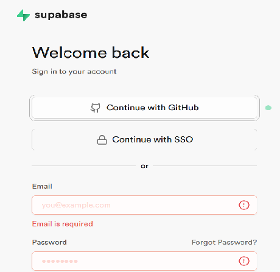

<br>

**La primera vez** debemos crear una organización:

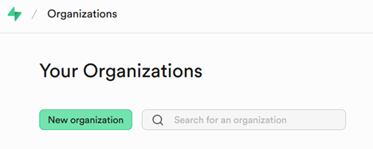

Y ahora crearemos un nuevo proyecto (también la primera vez). Este proyecto contendrá nuestra BD:

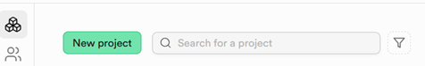

<br>

Una vez tengamos nuestro proyecto creado vamos a seguir esta guía rápida del propio Supabase en la que nos dirige a través de la creación de un proyecto flutter con una tabla Postgres en Supabase:

[Inicio Flutter Supabase](https://supabase.com/docs/guides/getting-started/quickstarts/flutter)

<br>

# <a name="_apartado2"></a>2. App Planetas

En este apartado vamos a adaptar la app planetas que trabajamos en el tema anterior de manera que dejemos de trabajar con la librería Floor en una BD local y lo hagamos con una tabla en la BD en la nube que hemos creado con anterioridad.

## Creación de la tabla Planetas

Para crear una nueva tabla en nuestra BD de Supabase tenemos dos opciones. Podemos ir a **Table Editor** donde crearíamos la tabla de modo visual o bien a **SQL Editor** donde podemos introducir una sentencia SQL que nos crearía la tabla:

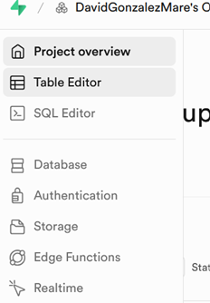

<br>

Si hacemos la tabla mediante el Table Editor tendríamos:

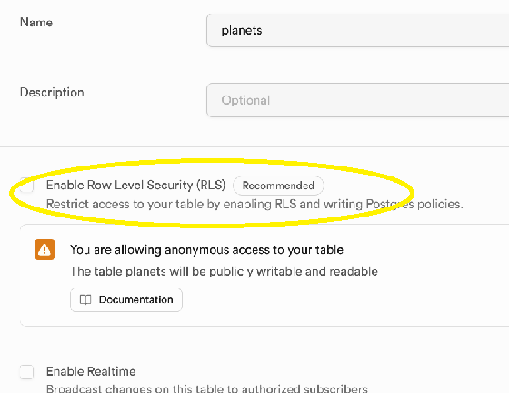

como vemos, de momento vamos a quitar el **Row Level Security (RLS)** que nos permite hacer cambios en los registros de la tabla sin ningún tipo de restricción de usuario (esto lo tendremos que cambiar más adelante por seguridad).

<br>

Y estos serían los dos únicos campos que va a tener mi tabla:

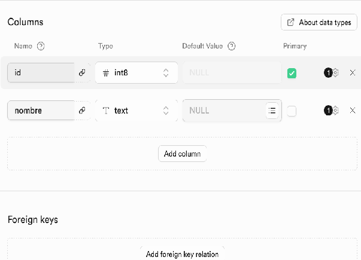

<br>

También podríamos crear la tabla desde **SQL Editor** con el siguiente código:

```sql
create table public.planets (
  id bigint generated by default as identity not null,
  nombre text null,
  constraint planets_pkey primary key (id)
) TABLESPACE pg_default;
```
<br>

## Primeros cambios en la aplicación

Para realizar este apartado nos vamos a apoyar en el ejercicio de la app de planetas que realizamos en el tema 7. Podemos hacer una copia del mismo.

En primer lugar vamos a **eliminar** aquellos ficheros y dependencias que no vamos a utilizar.

Podemos eliminar los siguientes ficheros de la carpeta `model`: `database.dart`, `database.g.dart` y `planeta.dao.dart`, ya que no vamos a trabajar con la BD local.

Mantenemos el resto de ficheros (`planeta.dart, favoritos_respository.dart, favoritos_provider.dart`...).

Además, en el fichero `pubspec.yaml` eliminaremos las líneas con las dependencias  `floor`, `floor_generator` y `build_runner`.

E instalaremos la librería `supabase_flutter`:

```
flutter pub add supabase_flutter
```
<br>

## Modelo. Clase Planeta

Empezamos a cambiar el código de la aplicación para **adaptarlo a Supabase** respecto a lo que hacíamos con Floor.

En primer lugar, cambiamos la clase `/model/planeta.dart`, ya que deja de ser una entidad de Floor, pasando a ser una clase que tendrá los campos de la tabla `planets` y le añadimos las funciones que mapean y permiten leer y escribir un registro en esa tabla:

```dart

class Planeta {
  final int? id;
  final String nombre;

  Planeta({this.id, required this.nombre});

  factory Planeta.fromMap(Map<String, dynamic> map) {
    return Planeta(
      id: map['id'],
      nombre: map['nombre'],
    );
  }

  Map<String, dynamic> toMap() {
    return {
      'id': id,
      'nombre': nombre,
    };
  }

  @override
  bool operator ==(Object other) {
    // Comparamos que sean de la misma clase y que el
    // valor de las propiedades sea el mismo
    return other is Planeta && other.id == id && other.nombre == nombre;
  }
}
```

<br>

## Data Source

Vamos a crear en este apartado el código que trabajará con la fuente de datos, en este caso la tabla `planets` de nuestra BD de `Supabase`.

Creamos una carpeta llamada `datasource` y dentro de la misma el fichero `datasource.dart`:

```dart
import 'package:planetas/model/planeta.dart';
import 'package:supabase_flutter/supabase_flutter.dart';

class DataSource {
  final SupabaseClient client;
  final String _tableName = 'planets';

  DataSource(this.client);

  Future<List<Planeta>> getAllPlanets() async {
    final response = await client.from(_tableName).select();
    
    return (response as List)
        .map((user) => Planeta.fromMap(user))
        .toList();
  }

  Future<void> insertPlanet(Planeta planeta) async {
    final response =
        await client.from(_tableName).insert(planeta.toMap());

    if (response != null) {
      throw response.error!;
    }
  }

  Future<void> deletePlanet(int id) async {
    final response = await client
        .from(_tableName) 
        .delete() // Método para eliminar
        .eq('id', id); // Ejecutar la consulta

    if (response != null) {
      throw response.error!;
    }
  }
}
```

En este fichero tenemos un cliente de Supabase que se inicializará en el provider (al iniciar la aplicación), y que nos permitirá realizar las operaciones de lectura, inserción y borrado sobre la tabla `planets` (`_tableName`). 

<br>

## Repositorio y Provider

Modificamos levemente `favoritos_repository.dart`, ya que ahora no conectamos con la BD local de Floor, sino con la BD del cliente de Supabase:

```dart
import 'package:planetas/datasource/datasource.dart';
import 'package:planetas/model/planeta.dart';

class FavoritosRepository {
  DataSource? _dataSource; // Referencia al DataSource

  FavoritosRepository._(); // Constructor privado

  // Instancia única del repositorio. La podemos crear directamente
  // en la inicialización
  static final FavoritosRepository _instance =
      FavoritosRepository._();

  // Quan se'ns demane el repositori retornem la instància.
  factory FavoritosRepository() {
    return _instance;
  }

  // Connexión a la base de datos
  Future<void> connectaDB() async {
    if (_dataSource == null) {
      // Inicializamos la conexión a la base de datos
      await Supabase.initialize(
        url: 'https://poneraquilaurlvuestra.supabase.co',
        anonKey:
            'poner aqui vuestra clave anon',
      );
      _dataSource = DataSource(Supabase.instance.client);
    }
  }

  // Añadimos como métodos del repositorio los propios de la clase DAO
  Future<List<Planeta>>? findAll() {
    return _dataSource?.getAllPlanets();
  }

  Future<void> insertPlanet(Planeta planeta) {
    return _dataSource?.insertPlanet(planeta) ?? Future.value();
  }

  Future<void> deletePlanet(Planeta planeta) {
    return _dataSource?.deletePlanet(planeta.id??-1) ?? Future.value();
  }
}
```

En nustro código, podemos ver que para la **conexión a nuestro proyecto de supabase** necesitamos la **url** y la **clave anon**. 

Para ello, dentro de Supabase, entramos en el proyecto y navegamos con el menú de la izquierda a **Project Settings - Data API**:

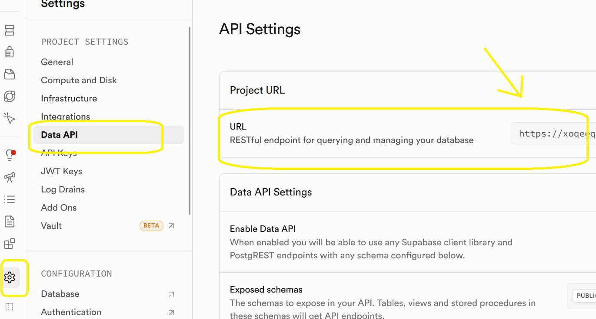

<br>

y para la la **clave anon**:

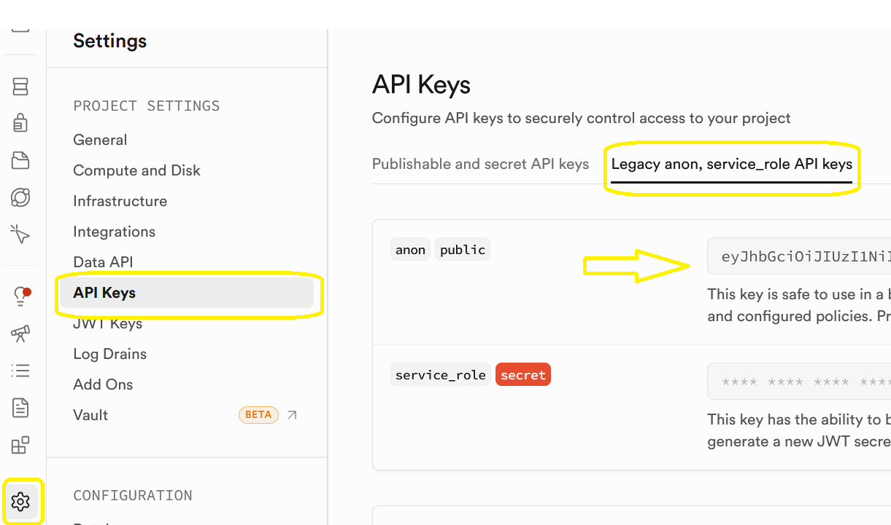

<br>

Como vemos cambia la fuente de datos que utilizamos, pero las funciones públicas siguen siendo las mismas que teníamos con Floor: `conectaDB`, `findAll`, `insertPlanet` y `deletePlanet`.

Y por tanto el Provider que tenemos en `/provider/favoritos_provider.dart` apenas cambia. 
Sí debemos tener en cuenta que en esta ocasión vamos a utilizar el `findAll` con un `Future` en vez de con un `Stream`:

```dart
import 'package:flutter/foundation.dart';
import 'package:planetas/model/planeta.dart';
import 'package:planetas/repository/favoritos_repository.dart';

class FavoritosProvider with ChangeNotifier {
  final FavoritosRepository _repository = FavoritosRepository();

  // Lista de favoritos para la carga inicial
  // Nos servirá para emitir la primera notificación de cambio de estado
  List<Planeta> _favoritos = [];

  FavoritosProvider() {
    // En el constructor hacemos una carga de los favoritos
    _cargarFavoritos();
  }

  Future<void> _cargarFavoritos() async {
    // Esperamos a tener una conexión lista en la BD
    await _repository.connectaDB();

    // Obtenemos la lista de favoritos
    final listaFavoritos = await _repository.findAll();
    _favoritos = listaFavoritos!;
    notifyListeners();
  }

  Future<List<Planeta>>? findAll() {
    return _repository.findAll();
  }

  Future<void> insertPlanet(Planeta planeta) async {
    await _repository.insertPlanet(planeta);
    notifyListeners();
  }

  Future<void> deletePlanet(Planeta planeta) async {
    await _repository.deletePlanet(planeta);
    notifyListeners();
  }
}
```
<br>

## Interfaz de usuario

La interfaz de usuario queda prácticamente igual que la que hicimos en el ejemplo del tema anterior, aunque cambiamos el `StreamBuilder` por un `FutureBuilder`, ya que hicimos eso con el `findAll`.

Fichero `/screens/lista_planetas_screen.dart`:

```dart
import 'package:flutter/material.dart';
import 'package:planetas/model/planeta.dart';

import 'package:planetas/provider/favoritos_provider.dart';
import 'package:provider/provider.dart';

class ListaPlanetas extends StatelessWidget {
  ListaPlanetas({super.key});

  // Declaramos una lista estática de planetas
  // En la base de datos, únicamente guardamos los favoritos
  final List<Planeta> planetas = [
    Planeta(id: 1, nombre: "Mercurio"),
    Planeta(id: 2, nombre: "Venus"),
    Planeta(id: 3, nombre: "Tierra"),
    Planeta(id: 4, nombre: "Marte"),
    Planeta(id: 5, nombre: "Júpiter"),
    Planeta(id: 6, nombre: "Saturno"),
    Planeta(id: 7, nombre: "Urano"),
    Planeta(id: 8, nombre: "Neptuno"),
  ];

  @override
  Widget build(BuildContext context) {
    // Definimos la referencia al Provider
    var favoritosProvider = Provider.of<FavoritosProvider>(context);

    return FutureBuilder<List<Planeta>>(
      future: favoritosProvider.findAll(),
      builder: (context, snapshot) {
        debugPrint(snapshot.connectionState.toString());
        if (snapshot.hasData) {
          // El snapshot contendrá la lista de planetas favorita

          // Construimos la lista de planetas, con un ListView Builder
          // Cada item será un ListTile, que contendrá como "trailing"
          // una estrella con la que podremos interactuar para marcar o
          // desmarcar el planeta como favorito.
          return ListView.builder(
              itemCount: planetas.length,
              itemBuilder: (BuildContext context, int index) {
                // Calculamos si el planeta es favorito o no
                bool esFavorito = _esFavorito(
                  planeta: planetas[index],
                  planetas: snapshot.data ?? [],
                );
                debugPrint(
                    "${planetas[index].nombre} es favorito: $esFavorito");
                return ListTile(
                    title: Text(planetas[index].nombre ?? ""),
                    trailing: MyStar(
                      planeta: planetas[index],
                      esFavorito: esFavorito,
                      onTap: () {
                        if (esFavorito) {
                          favoritosProvider.deletePlanet(planetas[index]);
                        } else {
                          favoritosProvider.insertPlanet(planetas[index]);
                        }
                      },
                    ));
              });
        } else {
          return const Center(child: CircularProgressIndicator());
        }
      },
    );
  }

  bool _esFavorito({required Planeta planeta, required List<Planeta> planetas}) {
    return planetas.contains(planeta);
  }
}

class MyStar extends StatelessWidget {
  const MyStar({super.key, this.planeta, this.esFavorito, this.onTap});

  final Planeta? planeta;
  final bool? esFavorito;
  final Function? onTap;

  @override
  Widget build(BuildContext context) {
    Widget? star;

    if (esFavorito ?? false) {
      star = const Icon(Icons.star);
    } else {
      star = const Icon(Icons.star_border_outlined);
    }

    return GestureDetector(
      child: star,
      onTap: () {
        onTap!();
      },
    );
  }
}
```
Y  `main.dart`:

```dart
void main() {
  runApp(const MainApp());
}

class MainApp extends StatelessWidget {
  const MainApp({super.key});

  @override
  Widget build(BuildContext context) {
    return ChangeNotifierProvider(
      create: (BuildContext context) => FavoritosProvider(),
      child: MaterialApp(
        debugShowCheckedModeBanner: false,
        title: 'Planetas favoritos',
        home: Scaffold(
            appBar: AppBar(title: const Text("Planetas Favoritos")),
            body: ListaPlanetas()),
      ),
    );
  }
}
```
<br>
<br>

# <a name="_apartado3"></a>3. App Students

Vamos en este apartado a ver cómo modificar la app *Students* que implementamos en el tema anterior, tal y como hicimos con la app de *Planetas*, para poder trabajar con una tabla definida de *Supabase*

Podemos partir para ello con una **copia de la aplicación**.

## Definición de la tabla `students` en Supabase

Lo podemos hacer en la misma BD o proyecto en el que declaramos la tabla `planets` aunque sean tablas que no tienen relación ninguna y su estructura podría ser la siguiente:

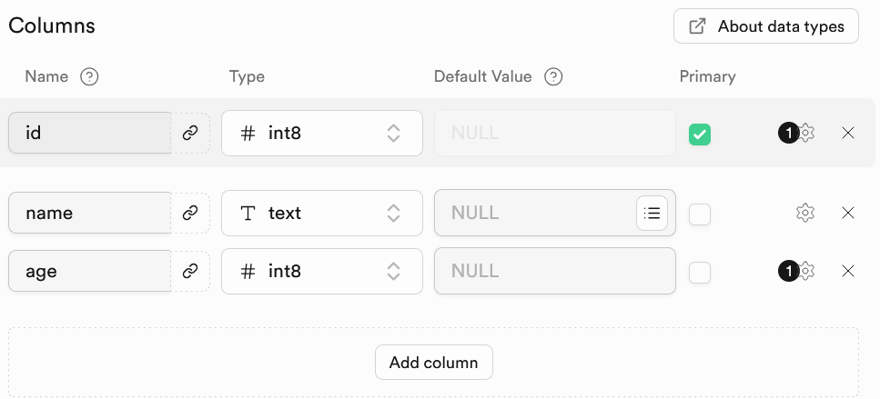

Es importante que la clave primaria id sea autoincremental, pudiendo ser este el código de definición de la tabla:

```sql
create table public.students (
  id bigint generated by default as identity not null,
  name text not null,
  age bigint null,
  constraint students_pkey primary key (id)
) TABLESPACE pg_default;
```
<br>

## Preparación de la aplicación

En este punto, y partiendo del proyecto que hicimos en el tema 7:

- Borramos los ficheros `/model/app_database.dart`, `/model/app_database.g.dart` y `/model/student_dao.dart`.
  
- En el fichero pubspec.yaml borramos las dependencias de `floor`, `floor_generator` y `build_runner`.
- Añadimos la dependencia a supabase_flutter con:

```
flutter pub add supabase_flutter
```
<br>

## Modelo de datos

Cambiamos el fichero `/model/student.dart` que deja de ser una entidad de floor:

```dart
class Student {
  final int? id;  // Nullable for auto-increment
  final String name;  
  final int age;

  Student({this.id, required this.name, required this.age});

  factory Student.fromMap(Map<String, dynamic> map) {
    return Student(
      id: map['id'],
      age: map['age'],
      name: map['name'],
    );
  }

  Map<String, dynamic> toMap() {
    return {
      //'id': id, Este no se pone ahora porque es autoincremental
      'name': name,
      'age': age,};
  }
}
```

Tengamos en cuenta que a la hora de mapear para guardar en la tabla de Supabase, no ponemos el id, ya que este se genera autoincrementalmente, tal y como definimos.

<br>

## Data Source

Crearemos el fichero `/data/datasource.dart`, al cual le pasamos el cliente de Supabase y realiza las operaciones de acceso a la tabla `students`:

```dart

class StudentDataSource {
  final SupabaseClient client;
  final String _tableName = 'students';

  StudentDataSource(this.client);

  // Este es el Stream. 
  Stream<List<Student>> streamAllStudents() {
    // El método stream devuelve un Stream de la tabla 'students'
    final  response = client.from(_tableName).stream(primaryKey: ['id']);

    return response.map((event) {
      // Mapeamos el resultado a una lista de estudiantes
      return event.map((user) => Student.fromMap(user)).toList();
    });
  }

  Future<List<Student>> getAllStudents() async {
    final response = await client.from(_tableName).select();

    return (response as List)
        .map((user) => Student.fromMap(user))
        .toList();
  }

  Future<void> insertStudent(Student student) async {
    final response =
        await client.from(_tableName).insert(student.toMap());

    if (response != null) {
      throw response.error!;
    }
  }

  Future<void> deleteStudent(int id) async {
    // Eliminar un registro de la tabla 'students' con un id específico
    final response = await client
        .from(_tableName)
        .delete() // Método para eliminar
        .eq('id', id); // Ejecutar la consulta

    if (response != null) {
      throw response.error!;
    }
  }

}
```
<br>

## Repositorio y Provider

Modificamos el repositorio (`/repository/app_repository.dart`)que tenemos en el que simplemente cambia la fuente de datos y la conexión a la misma, pero mantiene las mismas funciones:

```dart
import 'package:flutter_students_borrar/data/datasource.dart';
import 'package:flutter_students_borrar/model/student_entity.dart';
import 'package:supabase_flutter/supabase_flutter.dart';

class AppRepository {
  StudentDataSource? _dataSource;         // Referencia al DataSource

  AppRepository._();    // Constructor privado

  // Instancia única del repositorio. La podemos crear directamente
  // en la inicialización
  static final AppRepository _instance = AppRepository._();

  // Cuando se nos pida el repositorio, se devuelve la instancia única.
  factory AppRepository() {
    return _instance;
  }

  // Connexión a la BD (datasource)
  Future<void> connectaDB() async {
    if (_dataSource == null) {
      // Creamos la BD únicamentes si no se ha creado ya
      await Supabase.initialize(
        url: 'https://poneraquilaurlvuestra.supabase.co',
        anonKey:
            'poner aqui vuestra clave anon',
      );
      _dataSource = StudentDataSource(Supabase.instance.client);
    }
  }

  // Añadimos como métodos del repositorio los propios de la clase DataSource
  Stream<List<Student>> streamAllStudents() {
    return _dataSource?.streamAllStudents() ?? const Stream.empty();
  }


  Future <List<Student>>? getAllStudents() {
    return _dataSource?.getAllStudents() ?? Future.value([]);
  }

  Future<void> insertStudent(Student student) {
    return _dataSource?.insertStudent(student) ?? Future.value();
  }

  Future<void> deleteStudent(int id) {
    return _dataSource?.deleteStudent(id) ?? Future.value();
  }
}
```

<br>

Quedando el Provider (`/provider/app_provider.dart`) tal y como lo teníamos:

```dart
import 'package:flutter/foundation.dart';
import 'package:flutter_students_borrar/model/student_entity.dart';
import 'package:flutter_students_borrar/repository/app_respository.dart';

class AppProvider with ChangeNotifier {
  final AppRepository _repository = AppRepository();
  // Esta es la lista de estudiantes local.
  List<Student>? _students;

  AppProvider() {
    // En el constructor cargamos la BD
    _cargaBaseDatos();
  }

  Future<void> _cargaBaseDatos() async {
    // Esperamos a tener una conexión lista a la BD
    await _repository.connectaDB();
    notifyListeners();
  }

  // Getter para obtener la lista de estudiantes
  // Este getter llama a un método privado que carga la lista de estudiantes
  get listaStudents {
    _getAllStudentAsync();

    return _students;
  }

  // Método local para obtener la lista de estudiantes de manera asincrona	
  // y notificar a los listeners.
  _getAllStudentAsync() async {
    // Para probar que realmente sale el CircularProgressIndicator
    // y no se queda colgado, he puesto un delay de 5 segundos.
    // En la práctica no es necesario. Comentar la línea de abajo
    await Future.delayed(const Duration(seconds: 5));
    _students = await getAllStudents();
    notifyListeners();
  }

  Stream<List<Student>>? streamAllStudents() {
    return _repository.streamAllStudents();
  }

  Future<List<Student>>? getAllStudents() {
    return _repository.getAllStudents();
  }

  Future<void> insertStudent(Student student) async {
    await _repository.insertStudent(student);
    notifyListeners();
  }

  Future<void> deleteStudentById(int id) async {
    await _repository.deleteStudent(id);
    notifyListeners();
  }
}
```
<br>

**ATENCIÓN**: Os hago una pequeña modificación en el Provider para evitar que llamemos a la base de datos de supabase cada vez que utilizamos la lista de estudiantes (`get listaStudents`). Únicamente refrescamos esta lista cuando es necesario (de momento al insertar y al borrar un estuiante):

```dart
class AppProvider with ChangeNotifier {
  final AppRepository _repository = AppRepository();
  List<Student>? _students;

  AppProvider() {
    _init();
  }

  Future<void> _init() async {
    await _repository.connectaDB();
    _students = await _repository.getAllStudents();
    notifyListeners();
  }

  List<Student>? get listaStudents => _students;

  Future<void> refreshStudents() async {
    _students = await _repository.getAllStudents();
    notifyListeners();
  }

  Future<void> insertStudent(Student student) async {
    await _repository.insertStudent(student);
    await refreshStudents(); // refresca tras insertar
  }

  Future<void> deleteStudent(int id) async {
    await _repository.deleteStudent(id);
    await refreshStudents(); // refresca tras borrar
  }
}
```

<br>

## Interfaz

La interfaz de nuestra aplicación en principio no debe cambiar. Es decir, nos vale la interfaz que utilizamos en los ejercicios del tema anterior. Tanto la que utiliza `StreamBuilder` como la que no.

<br>

<hr>

## Trabajo con esquemas en Supabase

La información que hemos visto hasta el momento nos sirve para trabajar con tablas que hayamos creado en el esquema público de Supabase.

Si creáis estas tablas **dentro de un esquema** para tenerlas mejor organizadas:

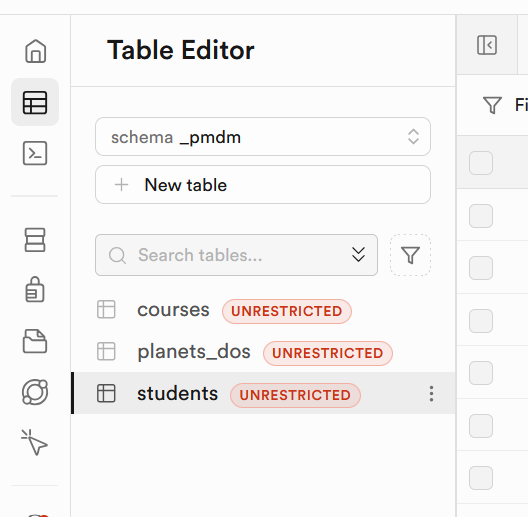

<br>

Para poder trabajar con estas tablas deberemos hacer una serie de pasos:

### Exponer el esquema en la API de Supabase

Para ello iremos a **Project Settings → API** en  Supabase.

En **Exposed schemas**, añaderimos `_pmdm` y guardaremos los cambios:

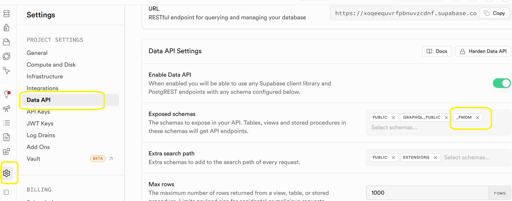

<br>

### Dar permisos a los roles de la API

Debemos dar permiso de uso sobre el esquema y permisos a las tablas para los roles anon y/o authenticated. 

Para ello iremos al SQL Editor de Supabase y escribiremos las siguientes sentencias:

```sql
-- Permitir uso del esquema
GRANT USAGE ON SCHEMA _pmdm TO anon, authenticated;

-- Permisos sobre tablas existentes
GRANT SELECT, INSERT, UPDATE, DELETE ON ALL TABLES IN SCHEMA _pmdm TO anon, authenticated;

-- Permisos sobre vistas y secuencias (opcional pero recomendado)
GRANT USAGE, SELECT ON ALL SEQUENCES IN SCHEMA _pmdm TO anon, authenticated;

```

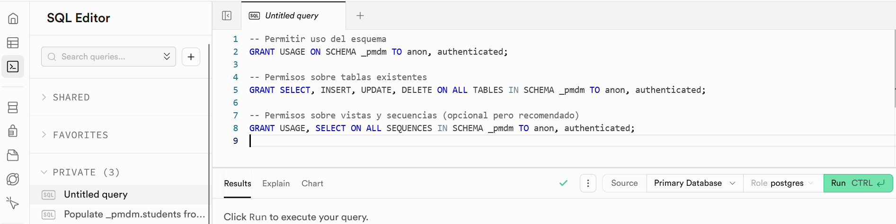

<br>

### Trabajar con el esquema en el cliente de supabase

**Todas las llamadas** que hacemos en el cliente de supabase deberemos indicarle el esquema con el que queremos trabajar siempre y cuando este no sea el esquema `public`:

```dart
  final String _schemaName = '_pmdm';
  final String _tableStudents = 'students';

  Future<List<Student>> getAllStudents() async {
    try {
      final response = await client
      .schema(_schemaName)    // Aquí indicamos el esquema
      .from(_tableStudents)
      .select()
      .order('id', ascending: true);

      return (response as List).map((user) => Student.fromMap(user)).toList();
    } catch (e) {
      print('❌ Error al obtener estudiantes: $e');
      return [];
    }
  }
```


